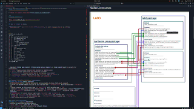

# LAB3 - Eater vs. Killer: Spawn–Forage–Pursuit (SFP) with RViz2 and Turtlesim+

An interactive lab implementing user-spawned “pizza” targets, service-driven turtle lifecycle management, and RViz2 click-to-pose evasion/pursuit behaviors using `turtlesim`.

## Important Notes
- Complete all of this and **commit your work by 16:00 2 SEP 2025 GMT+7**.
- Ensure you submit your Git link in Google Classroom.
- During the lab, you can access the internet as usual, but all Generative AI, including VSCode's Copilot and others, are prohibited.
- Submissions are based on **the time of the last commit**.
- **WARNING: If you do not follow these instructions exactly, your score will be 0 in all cases.**
- TA use this command to check your commits: ```git log --pretty=format:"%h - %an, %ar : %s -- %ad"```

Make an appointment for an examination by [Click here to queue](https://docs.google.com/spreadsheets/d/102x7QDbCxpxB_BmuFilWCqS9xsuPyOtY7FSXAnwPJss/edit?usp=sharing)

---

# Demo and Instructions Video

[](https://youtu.be/CMl5juOyN3I) 

---
# System Architecture


---

## Part 1 - Build All Nodes

**When users run** `git clone -b LAB3 [YOUR_GIT_LINK]`, the file structure must be as follows:


```
FRA502-LAB-StudentID/
├── src
│   ├── controller_interfaces
│   │   ├── CMakeLists.txt
│   │   ├── package.xml
│   │   └── srv
│   │       ├── SetMaxPizza.srv
│   │       ├── SetParam.srv
│   ├── lab3
│   │   ├── CMakeLists.txt
│   │   ├── include/
│   │   ├── lab3/
│   │   ├── package.xml
│   │   ├── scripts
│   │   │   ├── eater.py
│   │   │   ├── killer.py
│   │   └── src/
|   └── turtlesim_plus/
└── README.md

```

- Implement **three main nodes**, **three custom service types** and **one launch file** to satisfy the architecture:  
  - `eater` (handles pizza detection and movement to spawned pizza)  
  - `killer` (pursues eater after all pizzas are consumed)  
  - `SetMaxPizza.srv` (custom service type to set maximum pizza count)
  - `SetParam.srv` (custom service type to set `kp_linear` and `kp_angular`)
  - `lab3_bringup.launch.py` (launches all nodes and turtlesim+)

---
### Package `controller_interfaces` requirements
### What this package **must contain**
- **`SetMaxPizza.srv`** : use for setting the maximum number of pizzas that can be spawned.  
  - Define the maximum number of pizzas by this service type : `std_msgs/Int64` with variable name : `max_pizza` and 
  - Return response as this service type `std_msgs/String` with variable name : `log` 
  - Value of `log` must always show the maximum number of pizzas that can be spawned with a status **success** when value of `max_pizza` from service call `>` current `max_pizza` of Node `eater` . Otherwise  show status **failed**.
- **`SetParam.srv`** (custom service type to set `kp_linear` and `kp_angular`)
  - Define the `kp_linear` by this service type : `std_msgs/Int64` with variable name : `kp_linear` 
  - Define the `kp_angular` by this service type : `std_msgs/Int64` with variable name : `kp_angular` 
  - This custom service has no response.

### Launch file requirement
### What this launch file **must do**
- **It has to work like the demo video.**
- `eater` and `killer` nodes must be launched.
- `turtlesim_plus` must be included in the **launch file**.
- Topics must be remapped as necessary.
- Parameters for all nodes must be set.
- All nodes must be properly configured before starting.
- Able to configure frequency of `eater` node via **launch file** parameter with name `sampling_frequency` and default value `100.0` (Hz).
- Able to configure frequency of `killer` node via **launch file** parameter with name `sampling_frequency` and default value `100.0` (Hz).

### Node `eater` requirement
### What this node **must do**
- **Control XXXX to target position** by publishing velocity to `/XXXX/cmd_vel` using pose feedback from `/XXXX/pose` for navigation.
- **Accept click targets** from `/mouse_position`  and convert to turtlesim coordinates.
- **Forage mode operation** by continuously spawning pizzas at clicked locations via spawn service and eating them in order-by-order sequence using `/XXXX/eat` service - must handle simultaneous pizza spawning while executing eating sequence.
- **Evade mode operation** (when all pizzas eaten) robot must move to the target from `/mouse_position` .
- Able to use **ros2 param** to set and get parameter, name `sampling_frequency` with default value `100.0` (Hz). 
- Able to config **controller gain** via `/XXXX/set_param` service with request type `SetParam.srv`.
- Able to config **maximum pizza** via `/XXXX/set_max_pizza` service with request type `SetMaxPizza.srv`.

### Node `killer` requirement  
### What this node **must do**
- **Control YYYY to target position** by publishing velocity to `/YYYY/cmd_vel` using pose feedback from `/YYYY/pose`.
- **Track eater target** by subscribing to `/XXXX/pose` as moving pursuit target after all pizzas are eaten.
- **Terminate on capture** by calling `/remove_turtle` service when close enough to eater, then stop motion.
- Able to use **ros2 param** to set and get parameter, name `sampling_frequency` with default value `100.0` (Hz). 
- Able to config **controller gain** via `/XXXX/set_param` service with request type `SetParam.srv`.

### What the `eater` and `killer` Nodes Must Do Together

- Both nodes must be able to configure their controller gains via the `/XXXX/set_param` service for the `eater` node and the `/YYYY/set_param` service for the `killer` node.  
- While the `killer` is tracking the `eater`, if the **pizza** of `eater` is modified through a service call, the `killer` must adapt by waiting for the `eater` to finish eating all the pizza before continuing.  
- Use `/XXXX/eat_status` topic to monitor the eating status of the `eater` node.

### Student requirement
- **Modify the service and topic** of the `eater_node` so that the namespace can be defined according to the project structure as specified. The namespace will be named XXXX.
- **Modify the service and topic** of the `killer_node` so that the namespace can be defined according to the project structure as specified. The namespace will be named YYYY.
- **Perform a kill** on the turtle named `/turtle1` through a launch file.
- **Perform a spawn** for the turtle named `/XXXX` through a launch file, where XXXX will be the namespace name.
- **Perform a spawn** for the turtle named `/YYYY` through a launch file, where YYYY will be the namespace name.
- **Define the namespace** for the `eater_node` through a launch file according to the specified project structure.
- **Define the namespace** for the `killer_node` node through a launch file according to the specified project structure.

---
## **If the TA finds any issues, such as a node running but not meeting the requirements etc. , you will receive half the points for that issue in each node requirement.**

## Part 3 - Your Turn

Download the README.md file then fill your command for run all node when TA tests to you

Below is example

1. **Clone the repository** (replace `StudentID` with your own ID):
   ```bash
   git clone -b LAB3 https://github.com/<your-org>/FRA502-LAB-StudentID.git
    ```
2. **Run all nodes** (replace `StudentID` with your own ID):
   ```bash
   ros2 run FRA502-LAB-StudentID <node_name>
   ```


Modify the commands to match your package and node names. below here